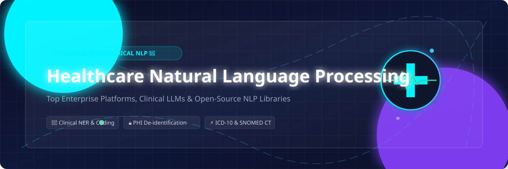

# Awesome-Healthcare-Natural-Language-Processing

# Awesome-Healthcare-Natural-Language-Processing

# Awesome-Healthcare-Natural-Language-Processing 🏥 🧠

  

  
  
  
  
  
  

---

## 🌟 Top Healthcare Natural Language Processing Ecosystem

**Curated List of Commercial Clinical NLP Platforms & Open-Source Medical NLP Tools**  
*Focused on Clinical Entity Extraction, ICD-10/SNOMED CT Coding, PHI De-identification, Clinical Summarization, Medical Relation Extraction & Self-Hosted Clinical NLP*

**Last updated: October 2026** 📅

---

### 📌 Overview & SEO Summary
Welcome to the ultimate curated directory of **healthcare natural language processing platforms**, **open-source clinical NLP frameworks**, and **medical text analytics tools**. Whether you are looking for enterprise-grade commercial solutions (such as *Amazon Comprehend Medical*, *John Snow Labs Spark NLP*, and *Nuance Dragon Medical*), or self-hostable open-source alternatives (like *MedSpaCy*, *scispaCy*, and *CLAMP*), this list covers category leaders, clinical entity extraction, and privacy-respecting medical NLP.

**Key Market Context:**
- **MedSpaCy** is the **leading open-source clinical NLP library**, with **500+ GitHub stars** and **clinical-specific components** for negation detection, section detection, and target matching.
- **scispaCy** is the **most widely used biomedical NLP library**, with **1.5K+ GitHub stars** and **pretrained models** for biomedical named entity recognition, parsing, and abbreviation detection.
- **Amazon Comprehend Medical** is the **most comprehensive managed clinical NLP service**, with **medical entity extraction, ICD-10-CM linking, RxNorm linking, and PHI de-identification**.

---

## 📑 Table of Contents
- [🏢 SaaS & Commercial Platforms](#-saas--commercial-platforms)
- [🔓 Open-Source GitHub Projects](#-open-source-github-projects)
- [🛠️ How to Contribute](#%EF%B8%8F-how-to-contribute)
- [📊 Star History](#-star-history)
- [🤝 Support & Sponsorship](#-support--sponsorship)
- [⚠️ Disclaimer](#%EF%B8%8F-disclaimer)

---

## 🏢 SaaS / Commercial Platforms

The healthcare NLP market spans **hyperscaler medical NLP services** (Amazon Comprehend Medical, Google Cloud Healthcare NLP, Azure AI Health Insights) that provide **managed clinical entity extraction and PHI de-identification**, **enterprise clinical NLP platforms** (John Snow Labs Spark NLP, Clinithink, IQVIA NLP) that offer **large-scale medical coding and analytics**, and **clinical documentation platforms** (Nuance Dragon Medical, 3M M*Modal) that combine **speech recognition with clinical NLP**. **Amazon Comprehend Medical** charges **$0.01 per 100 characters** for entity extraction . **John Snow Labs Spark NLP** is **open-core** with **Healthcare NLP licensed from $20K/year**. **Azure AI Health Insights** uses **consumption-based pricing**.

| SaaS / Commercial Platform | Company / Owner | Valuation / Market Cap | Standard Edition Starting Price | Free Tier / Free Trial Limits | Description |
| :--- | :--- | :--- | :--- | :--- | :--- |
| **[Amazon Comprehend Medical](https://aws.amazon.com/comprehend/medical/)** ☁️ | Amazon | ~$2.0 Trillion | **$0.01 per 100 characters** (entity extraction) | **Free tier: 25K characters/month for 12 months**  | **AWS-native clinical NLP** — **Medical entity extraction (anatomy, medical conditions, medications, procedures, tests)** . **ICD-10-CM, RxNorm, and SNOMED CT linking** . **PHI de-identification** . **Relationship extraction** . **HIPAA-eligible** . |
| **[Google Cloud Healthcare Natural Language API](https://cloud.google.com/healthcare-api/docs/concepts/nlp)** 🌐 | Google (Alphabet) | ~$2.0 Trillion | **Consumption-based pricing** | **$300 free credits** | **GCP-native healthcare NLP** — **Extracts medical entities and relationships** . **FHIR-native output** . **Medical coding support** . **De-identification integration** . |
| **[Azure AI Health Insights](https://azure.microsoft.com/en-us/products/ai-services/ai-health-insights/)** 🔷 | Microsoft | ~$3.90 Trillion | **Consumption-based pricing** | **Free tier: limited** | **Azure-native clinical NLP** — **Clinical document analysis and radiology insights** . **Cancer profiling and trial matching** . **FHIR integration** . **HIPAA and HITRUST compliant** . |
| **[John Snow Labs Spark NLP](https://www.johnsnowlabs.com/)** 🎯 | John Snow Labs | Private | **Healthcare NLP: from $20K/year** | **Free trial available** | **Enterprise clinical NLP** — **The most widely used clinical NLP library in production** . **200+ pretrained models** for NER, assertion status, relation extraction, and de-identification . **50+ languages** . **Apache Spark and Python native** . |
| **[Clinithink](https://www.clinithink.com/)** 🔵 | Clinithink | Private | **Custom enterprise pricing** | **Demo available** | **Clinical NLP platform** — **Unlocks unstructured clinical text** . **Automated clinical coding and quality measurement** . **Used by payers and providers** . |
| **[Nuance Dragon Medical](https://www.nuance.com/healthcare/dragon-medical-one.html)** 🐉 | Microsoft (Nuance) | ~$3.90 Trillion | **Custom enterprise pricing** | **Demo available** | **Clinical speech recognition** — **Cloud-based voice recognition with medical vocabulary** . **Deep EHR integration** . **The incumbent clinical dictation standard** . |
| **[IQVIA NLP](https://www.iqvia.com/)** 📊 | IQVIA | ~$40 Billion | **Custom enterprise pricing** | **Demo available** | **Life sciences NLP** — **Extracts insights from clinical trial data and real-world evidence** . **Regulatory-grade analytics** . |
| **[3M M*Modal](https://www.3m.com/3M/en_US/health-information-systems-us/)** 🏥 | 3M Health Information Systems | ~$60 Billion (3M) | **Custom enterprise pricing** | **Demo available** | **Clinical documentation and coding** — **Speech recognition with clinical NLP** . **CDI and coding automation** . |
| **[SyTrue](https://sytrue.com/)** 🟢 | SyTrue | Private | **Custom enterprise pricing** | **Demo available** | **Clinical NLP platform** — **Automates risk adjustment and quality coding** . **Extracts clinical data from unstructured records** . |
| **[Melax Technologies](https://www.melaxtech.com/)** 🟣 | Melax Technologies | Private | **Custom enterprise pricing** | **Demo available** | **Medical NLP platform** — **Entity extraction, ICD coding, and clinical document classification** . **Specialized in Chinese medical NLP** . |

---

## 🔓 Open-Source GitHub Projects

*Sorted by GitHub_Stars_Count (Descending)* 🌟

- **[scispaCy](https://github.com/allenai/scispacy)**   
  **Biomedical and scientific NLP library**, Apache-2.0 licensed. **1.5K+ GitHub stars** — **the most widely used biomedical NLP library** . **Pretrained models** for **biomedical named entity recognition (BC5CDR, BIONLP13CG, JNLPBA)** . **UMLS entity linking** . **Abbreviation detection** . **The foundation for open-source clinical NLP** . 🧬

- **[MedSpaCy](https://github.com/medspacy/medspacy)**   
  **Clinical NLP library built on spaCy**, MIT licensed. **500+ GitHub stars** — **the leading open-source clinical NLP library** . **Clinical-specific components**: **negation detection (NegEx/ConText), section detection, target matching, and post-processing** . **Pretrained clinical models** . **The definitive open-source clinical NLP toolkit** . 🏥

- **[CLAMP](https://github.com/HITR-C/CLAMP)**   
  **Clinical Language Annotation, Modeling, and Processing toolkit**, Apache-2.0 licensed. **The most comprehensive open-source clinical NLP toolkit** — **named entity recognition, assertion detection, and relation extraction** . **Pretrained models for multiple clinical NLP tasks** . **The academic standard for clinical NLP** . 🔬

- **[Open Health Natural Language Processing (OHNLP)](https://github.com/OHNLP)**   
  **Open-source clinical NLP platform**, Apache-2.0 licensed. **Developed by Mayo Clinic and partners** — **extracts medical entities from clinical text** . **Supports ICD-10, SNOMED CT, and RxNorm** . **The most comprehensive open-source clinical NLP toolkit** . 🧠

- **[cTAKES](https://github.com/apache/ctakes)**   
  **Apache clinical Text Analysis and Knowledge Extraction System**, Apache-2.0 licensed. **The original open-source clinical NLP system** — **developed by Mayo Clinic and Apache** . **Named entity recognition, assertion detection, and relation extraction** . **UMLS integration** . **The foundation for modern clinical NLP** . 🏛️

- **[MetaMap Lite](https://github.com/lhncbc/metamap-lite)**   
  **Lightweight UMLS concept extraction**, open-source. **The modern successor to MetaMap** . **Maps clinical text to UMLS concepts** . **The NLM's official clinical concept extraction tool** . 🧪

- **[NegBio](https://github.com/ncbi-nlp/NegBio)**   
  **Negation and uncertainty detection for biomedical text**, MIT licensed. **The standard for biomedical negation detection** . **Used with PubMed and clinical notes** . **The NCBI's open-source negation detection library** . 🚫

- **[Med7](https://github.com/kormilitzin/med7)**   
  **Named entity recognition for clinical text**, MIT licensed. **Extracts 7 entity types**: **drug, dosage, duration, form, frequency, route, and strength** . **spaCy-based** . **Pretrained model for medication extraction** . 💊

- **[MedCAT](https://github.com/CogStack/MedCAT)**   
  **Medical Concept Annotation Toolkit**, MIT licensed. **Extracts and links clinical concepts to SNOMED CT and UMLS** . **Context-aware concept extraction** . **Used by NHS and CogStack** . 🏴󠁧󠁢󠁥󠁮󠁧󠁿

- **[BioBERT](https://github.com/dmis-lab/biobert)**   
  **Pretrained biomedical language representation model**, Apache-2.0 licensed. **The foundation for biomedical NLP** . **Pretrained on PubMed and PMC** . **The standard for biomedical named entity recognition** . 🔬

- **[PubMedBERT](https://github.com/microsoft/BiomedNLP-PubMedBERT)**   
  **Domain-specific language model for biomedical text**, MIT licensed. **Pretrained from scratch on biomedical literature** . **Outperforms BioBERT on several biomedical NLP tasks** . **The most accurate open-source biomedical language model** . 📚

- **[MedNLI](https://github.com/jgc128/mednli)**   
  **Medical natural language inference dataset**, open-source. **The standard benchmark for medical NLI** . **Used for clinical text understanding** . 🧪

---

## 🛠️ How to Contribute

Contributions are welcome! Follow these steps to submit new healthcare NLP platforms or open-source clinical NLP software:

1. 🍴 **Fork** the repository.
2. 📝 **Add/edit** entries in `README.md` maintaining table/list structure and formatting.
3. 🔗 Include project title, official website/GitHub link, exact Stars_Count, license, and brief description.
4. 🚀 Submit a **Pull Request** with a descriptive summary of your changes.

---

## 📊 Star History

---

## 🤝 Support & Sponsorship

If you find this healthcare NLP repository useful, please consider supporting the project:

- ⭐ **Star** this repository to increase visibility!
- 🔀 **Fork** and share with fellow clinical NLP engineers, healthcare data scientists, and open-source advocates.
- ☕ **Sponsor & Buy Me a Coffee**: Support ongoing open-source curation via the [GitHub Sponsor Dashboard](https://github.com/sponsors/ishandutta2007).

---

## ⚠️ Disclaimer

- This is a **community-curated** list — not exhaustive and not an endorsement. ℹ️
- **Amazon Comprehend Medical charges $0.01 per 100 characters** for entity extraction with **25K characters/month free for 12 months** . **John Snow Labs Spark NLP Healthcare starts at $20K/year** . **Azure AI Health Insights** uses **consumption-based pricing** .
- **MedSpaCy is the leading open-source clinical NLP library** with **500+ GitHub stars** and **clinical-specific components** for negation detection and section detection . **scispaCy is the most widely used biomedical NLP library** with **1.5K+ GitHub stars** .
- **Open-source clinical NLP tools are not turnkey** — they require **clinical data, HIPAA compliance infrastructure, and NLP expertise** . **MedSpaCy requires spaCy and clinical models** . **CLAMP requires Java and UIMA** . **Always validate entity extraction accuracy and PHI handling with a proof-of-concept** before production deployment . 🏥

---

  <b>Made with ❤️ for clinical NLP engineers, healthcare data scientists, and open-source medical NLP advocates.</b>

